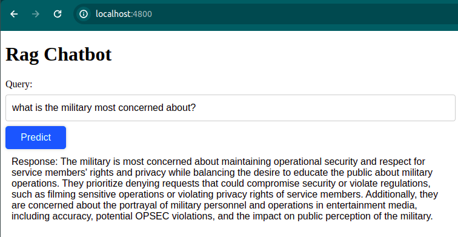

# Hollywood-Hooah 
## Retrieval Augmented Generative Chat

#### Overview
Welcome to the repository for my chatbot. This chatbot uses a retrieval augmented generative (RAG) chatbot architecture to help researchers understand a dense collection of documents detailing collaboration between the US Department of Defense and entertainment companies.

The database of documents that the chatbot uses are currently private, but a website is in the works. The documents are curated and controlled by Professor Roger Stahl at the University of Georgia; If you are a researcher interested in the documents, please reach out to me. You can learn more about Prof. Stahl's research through his excellent documentary, [Theaters of War](https://www.imdb.com/title/tt11841496/).

#### Contents

This repo is at it's early stages, so check back soon for more.
 
 - [notebook of example synthetic questions and answers](model/notebooks/test_chatbot_syntheticq.ipynb)
 - A simple microservices app with angular, screenshot:

