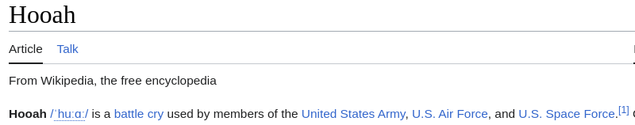

# Hollywood-Hooah 
## Retrieval Augmented Generative Chat

### Overview
Welcome to the repository for my chatbot. This chatbot uses a retrieval augmented generative (RAG) chatbot architecture to help researchers understand a dense collection of documents detailing collaboration between the US Department of Defense and entertainment companies.

The database of documents that the chatbot uses are currently private, but a website is in the works. The documents are curated and controlled by Professor Roger Stahl at the University of Georgia; If you are a researcher interested in the documents, please reach out to me. You can learn more about Prof. Stahl's research through his excellent documentary, [Theaters of War](https://www.imdb.com/title/tt11841496/).

---

---

This repo is at it's early stages, so check back soon for more.
#### Examples 
 - [notebook of example synthetic questions and answers](model/notebooks/test_chatbot_syntheticq.ipynb)
 - A simple microservices app with angular, screenshot:

### steps to run
 - model/scripts/extract_pdf_text.py
 - model/scripts/create_embeddings.py
 - model/notebooks/create_synthetic_questions.ipynb
 - run the chatbot
   - [from the command line](model/scripts/query_chatbotSyntheticQ.py)
   - [from a notebook](model/notebooks/test_chatbot_syntheticq.ipynb)
   - stand up the micro-services application and use the angular page (instructions coming soon)

### Embedding & cleaning the docs
 - [extract and clean text](model/ragchat/pdf_reader.py)
   - PyMuPDF to process blocks of text joined with double line-breaks to facilitate LLM understanding
   - remove lots of extra spaces and less meaningful line breaks
   - [runs parallel using python multiprocessing queues, etc.](model/ragchat/mp_helper.py)
   - [store in MongoDB](model/ragchat/doc_store.py)
 - [Embed chunks of text](model/ragchat/text_embedder.py)
   - retrieiving from MongoDB
   - control chunk size with configs
   - prepend title (filename) to cleaned text
   - embed in langchain's FAISS, save and retrieve when needed

### Creating, storing, and embedding synthetic questions
 - [notebook for creating synthetic questions](model/notebooks/create_synthetic_questions.ipynb)
 - Uses a simple prompt to generate a configurable # of questions for each N tokens of reference documentation.
 - LLM response parsed into individual questions, which are stored in MongoDB, embedded, and added to an FAISS vector store.
 - MongoDB collection also used for caching answers to synthetic questions (see chatbot architectures, below.)

### [Chatbot Architectures](model/ragchat/chatbots.py)
  - RagChatbot - simple- 
    - langchain/faiss default of around 5 docs retrieved and used as reference
  - RagChatbotMultiRetrieverCombiner - custom multi-document retriever -
    - merge best retrieved documents up to a token limit
  - RagChatbotMultiQA - custom 1 answer per doc combiner 
    - queries each of multiple retrieved documents for answers then uses LLM to extract a final answer
  - RagChatSyntheticQ Synthetic related question-answer - [example notebook](model/notebooks/test_chatbot_syntheticq.ipynb)
    - [uses synthetic questions and their own vector store](notebooks/create_synthetic_questions.ipynb)
    - queries vector store of synthetic questions, creates answers using the associated page(s) and uses LLM to integrate question-answer pairs into a final answer
    - answers cached in mongoDB and retrieved if available
    - also useful for suggesting related questions to the user
    